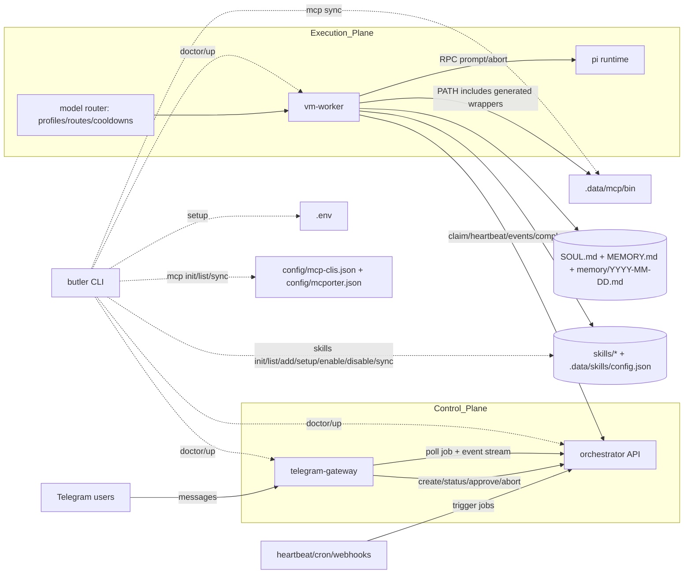
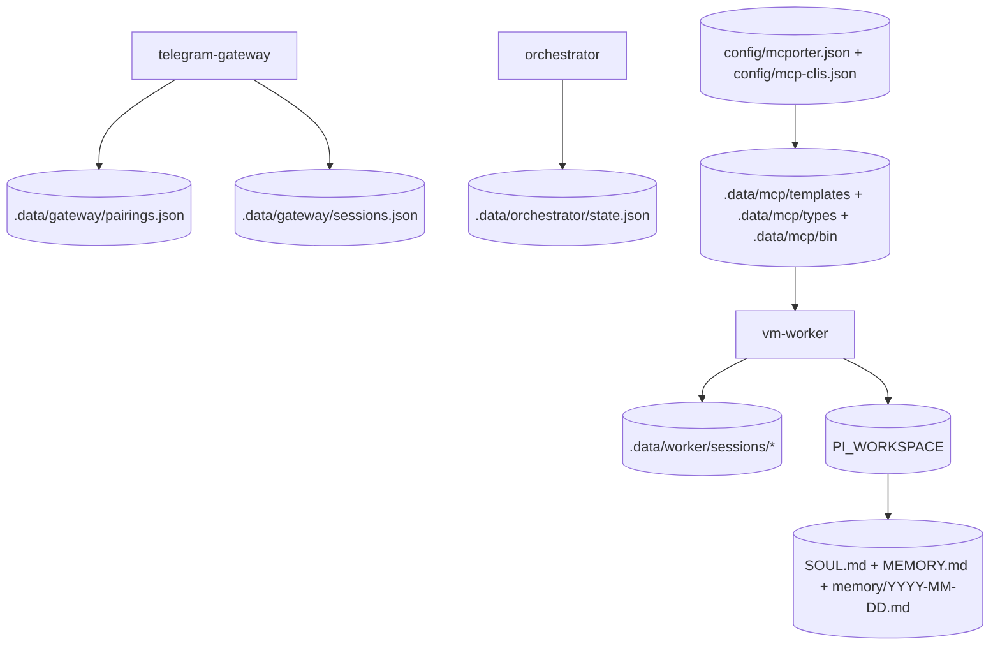
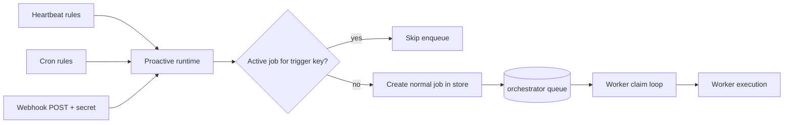
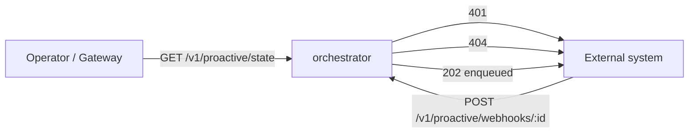
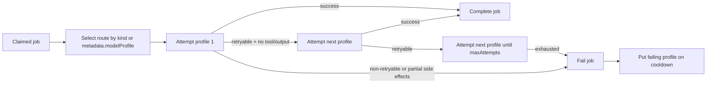
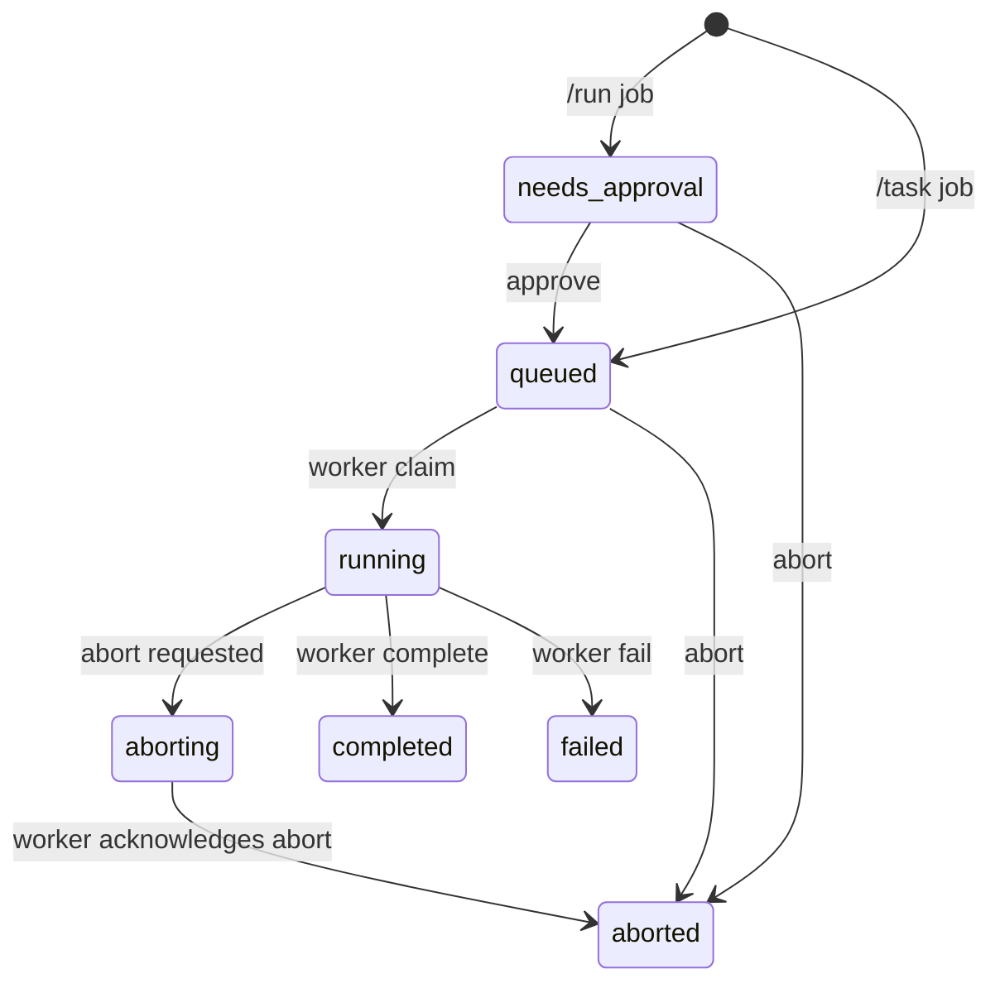

# Architecture

This document captures the current architecture of the personal Pi + Telegram agent stack.
Update it as you add features and keep diagrams aligned with code.

Related operating docs:
- `AGENTS.md`
- `docs/PLANS.md`
- `docs/SECURITY.md`
- `docs/RELIABILITY.md`

## Runtime topology (implemented)

## Persistence surfaces

## Component responsibilities

- `telegram-gateway` handles Telegram commands, pairing, role checks, rate limits, and job status updates.
- `orchestrator` is the source of truth for job state, queueing, event history, and global pause state.
- `orchestrator` also hosts proactive trigger runtime (heartbeats, cron rules, webhook ingress) and enqueues regular jobs.
- `vm-worker` claims jobs and executes them in `mock` or `rpc` mode.
- `vm-worker` includes model routing that selects a profile chain (by job kind/metadata) and performs guarded fallback.
- `vm-worker` enforces worker-local tool policy rules (allow/deny) during RPC tool invocation.
- `vm-worker` selects enabled local skills from `skills/*` and injects skill guidance into job prompt context.
- `pi` runtime is only invoked by `vm-worker`.
- `butler` CLI is the entrypoint for setup, health checks, local multi-service startup, and MCP CLI generation.
- In RPC mode, worker defaults PI workspace to repo root so personality/memory markdown files are shared context.
- `packages/contracts` defines request/response schemas shared by gateway, orchestrator, and worker.

## Capabilities unlocked by proactive runtime

- Scheduled autonomy: recurring checks and routines without waiting for a Telegram message.
- Event-driven automation: external systems can trigger Butler through authenticated webhooks.
- Unified execution path: proactive jobs use the same queue, approval model, and worker lifecycle as user jobs.
- Trigger safety: per-trigger dedupe prevents queue floods while a prior run is still active.
- Operator visibility: proactive scheduler health and counts are visible via API.

## Proactive trigger flow

## Proactive state + control visibility

## Model routing + fallback flow

## Job lifecycle

## Implementation alignment

The code follows the same boundaries shown above:

- Gateway command handling and policy checks: `apps/telegram-gateway/src/index.ts`
- Gateway pairing state persistence: `apps/telegram-gateway/src/pairing-store.ts`
- Gateway session context persistence: `apps/telegram-gateway/src/session-store.ts`
- Gateway client for orchestrator HTTP API: `apps/telegram-gateway/src/orchestrator-client.ts`
- Orchestrator API routes and auth separation (gateway token vs worker token): `apps/orchestrator/src/index.ts`
- Orchestrator job queue/state machine and JSON persistence: `apps/orchestrator/src/store.ts`
- Worker claim loop, heartbeat, and completion/failure flow: `apps/vm-worker/src/index.ts`
- Worker Pi RPC session lifecycle: `apps/vm-worker/src/pi-rpc-session.ts`
- Worker model routing and fallback runtime: `apps/vm-worker/src/model-routing.ts`
- Worker tool policy runtime: `apps/vm-worker/src/tool-policy.ts`
- Shared schemas/contracts at API boundaries: `packages/contracts/src/index.ts`

## Security and policy implemented

- Pairing gate for unknown Telegram users.
- Owner allowlist required (`TG_OWNER_IDS`).
- Strong API secrets required for gateway/worker orchestration (`16+` chars).
- `/run` is owner-only by default and always requires approval.
- Non-owner users can only view their own jobs in their own chat.
- Optional requester abort is configurable.
- Rate limiting and max prompt length in gateway.
- Chat/session context is isolated per `chatId + threadId` and rotated with `/new` or `/reset`.
- Worker-local tool policy can deny runtime tools by job kind/profile and fail denied invocations.
- Telegram output defaults to agent-text-only (`TG_ONLY_AGENT_OUTPUT=true`), while approval and lifecycle notices remain available when needed.
- Global panic switch (`/panic on|off`) pauses worker claims.

## HTTP interfaces

### Gateway -> Orchestrator

- `POST /v1/jobs`
- `GET /v1/jobs/:jobId`
- `GET /v1/jobs/:jobId/events`
- `POST /v1/jobs/:jobId/approve`
- `POST /v1/jobs/:jobId/abort`
- `GET /v1/admin/state`
- `POST /v1/admin/pause`
- `POST /v1/admin/resume`
- `GET /v1/proactive/state`
- `GET /v1/proactive/config`
- `GET /v1/proactive/runs`
- `POST /v1/proactive/rules/heartbeat`
- `DELETE /v1/proactive/rules/heartbeat/:id`
- `POST /v1/proactive/rules/cron`
- `DELETE /v1/proactive/rules/cron/:id`
- `GET /v1/proactive/deliveries/pending`
- `POST /v1/proactive/deliveries/:jobId/ack`
- `GET /v1/tools`
- `POST /v1/tools/invoke`

### Worker -> Orchestrator

- `POST /v1/workers/claim`
- `POST /v1/workers/:jobId/events`
- `GET /v1/workers/:jobId/heartbeat`
- `POST /v1/workers/:jobId/complete`
- `POST /v1/workers/:jobId/fail`
- `POST /v1/workers/:jobId/aborted`

### External -> Orchestrator (Proactive webhook ingress)

- `POST /v1/proactive/webhooks/:webhookId`

## Next extension points

- Replace JSON state with PostgreSQL + migrations.
- Add Telegram webhook mode + secret token validation.
- Add inline keyboard actions for approve/abort/status.
- Add per-job artifact upload/download path.
- Expand tool policy from worker-local config to orchestrator-managed policy controls.
