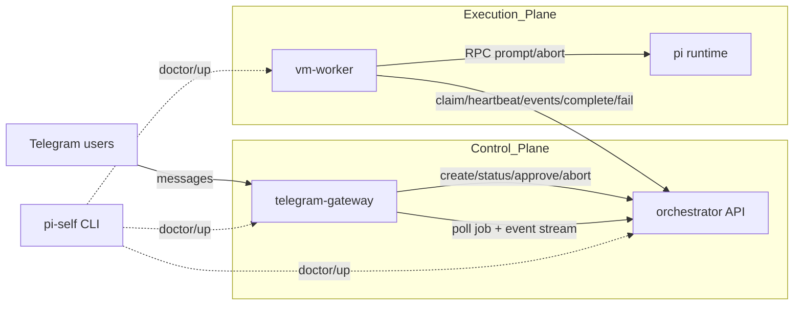
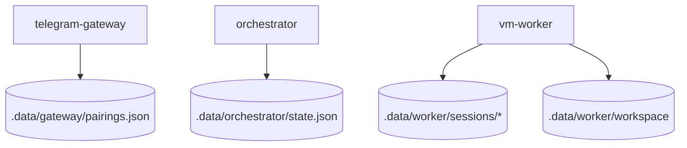
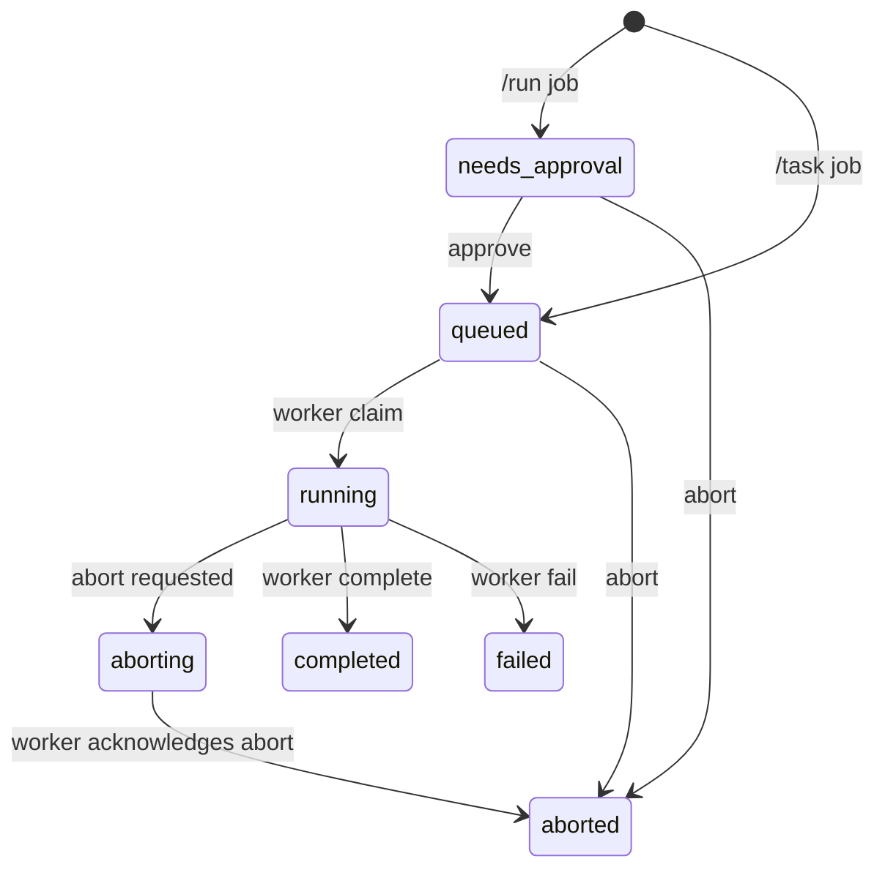

# Architecture

This document captures the current architecture of the personal Pi + Telegram agent stack.
Update it as you add features and keep diagrams aligned with code.

Related operating docs:
- `AGENTS.md`
- `docs/PLANS.md`
- `docs/SECURITY.md`
- `docs/RELIABILITY.md`

## Runtime topology (implemented)

## Persistence surfaces

## Component responsibilities

- `telegram-gateway` handles Telegram commands, pairing, role checks, rate limits, and job status updates.
- `orchestrator` is the source of truth for job state, queueing, event history, and global pause state.
- `vm-worker` claims jobs and executes them in `mock` or `rpc` mode.
- `pi` runtime is only invoked by `vm-worker`.
- `packages/contracts` defines request/response schemas shared by gateway, orchestrator, and worker.

## Job lifecycle

## Implementation alignment

The code follows the same boundaries shown above:

- Gateway command handling and policy checks: `apps/telegram-gateway/src/index.ts`
- Gateway pairing state persistence: `apps/telegram-gateway/src/pairing-store.ts`
- Gateway client for orchestrator HTTP API: `apps/telegram-gateway/src/orchestrator-client.ts`
- Orchestrator API routes and auth separation (gateway token vs worker token): `apps/orchestrator/src/index.ts`
- Orchestrator job queue/state machine and JSON persistence: `apps/orchestrator/src/store.ts`
- Worker claim loop, heartbeat, and completion/failure flow: `apps/vm-worker/src/index.ts`
- Worker Pi RPC session lifecycle: `apps/vm-worker/src/pi-rpc-session.ts`
- Shared schemas/contracts at API boundaries: `packages/contracts/src/index.ts`

## Security and policy implemented

- Pairing gate for unknown Telegram users.
- Owner allowlist required (`TG_OWNER_IDS`).
- Strong API secrets required for gateway/worker orchestration (`16+` chars).
- `/run` is owner-only by default and always requires approval.
- Non-owner users can only view their own jobs in their own chat.
- Optional requester abort is configurable.
- Rate limiting and max prompt length in gateway.
- Global panic switch (`/panic on|off`) pauses worker claims.

## HTTP interfaces

### Gateway -> Orchestrator

- `POST /v1/jobs`
- `GET /v1/jobs/:jobId`
- `GET /v1/jobs/:jobId/events`
- `POST /v1/jobs/:jobId/approve`
- `POST /v1/jobs/:jobId/abort`
- `GET /v1/admin/state`
- `POST /v1/admin/pause`
- `POST /v1/admin/resume`

### Worker -> Orchestrator

- `POST /v1/workers/claim`
- `POST /v1/workers/:jobId/events`
- `GET /v1/workers/:jobId/heartbeat`
- `POST /v1/workers/:jobId/complete`
- `POST /v1/workers/:jobId/fail`
- `POST /v1/workers/:jobId/aborted`

## Next extension points

- Replace JSON state with PostgreSQL + migrations.
- Add Telegram webhook mode + secret token validation.
- Add inline keyboard actions for approve/abort/status.
- Add per-job artifact upload/download path.
- Add explicit policy engine (tool allow/deny, command classes).
