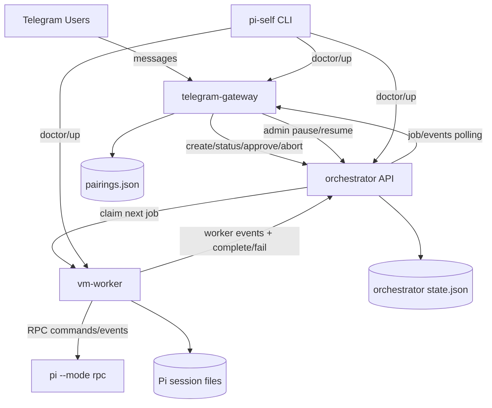
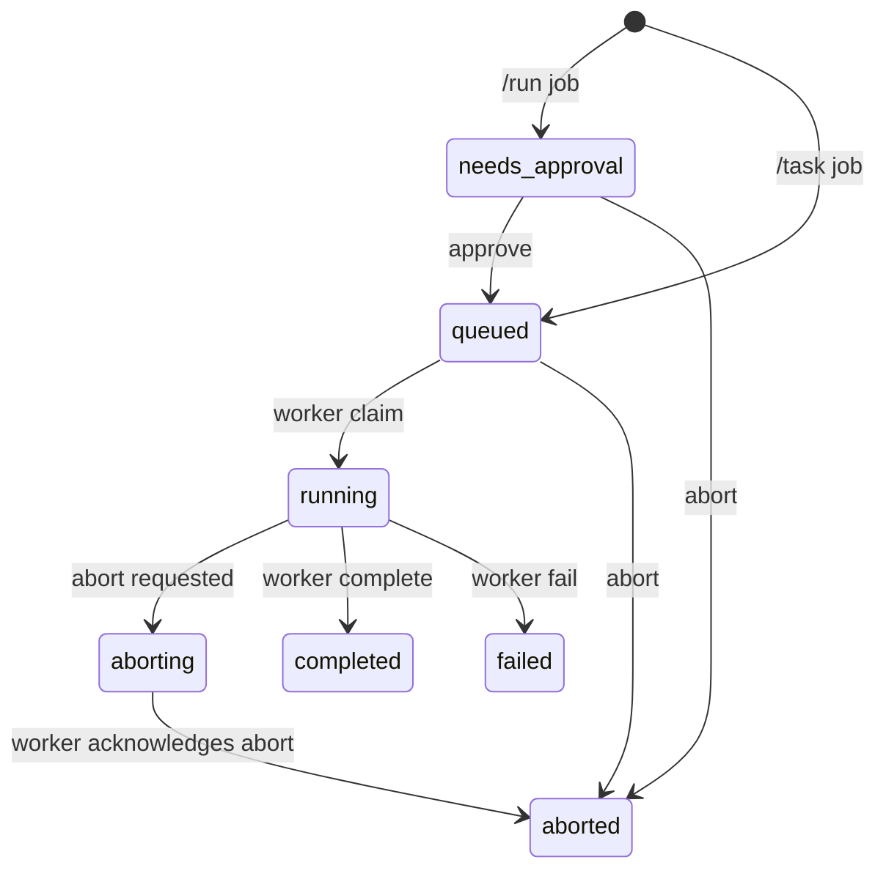

# Architecture

This document captures the current architecture of the personal Pi + Telegram agent stack.
Update it as you add features.

## System diagram

## Runtime model

- `telegram-gateway` is the control surface for users.
- `orchestrator` owns queue and job lifecycle.
- `vm-worker` runs in sandbox VM and executes jobs.
- `pi` runtime is accessed by worker in RPC mode (or mock mode for local testing).

## Job lifecycle

## Security and policy implemented

- Pairing gate for unknown Telegram users.
- Owner allowlist required (`TG_OWNER_IDS`).
- Strong API secrets required for gateway/worker orchestration (`16+` chars).
- `/run` is owner-only by default and always requires approval.
- Non-owner users can only view their own jobs in their own chat.
- Optional requester abort is configurable.
- Rate limiting and max prompt length in gateway.
- Global panic switch (`/panic on|off`) pauses worker claims.

## Current interfaces

### Gateway -> Orchestrator

- `POST /v1/jobs`
- `GET /v1/jobs/:jobId`
- `GET /v1/jobs/:jobId/events`
- `POST /v1/jobs/:jobId/approve`
- `POST /v1/jobs/:jobId/abort`
- `GET /v1/admin/state`
- `POST /v1/admin/pause`
- `POST /v1/admin/resume`

### Worker -> Orchestrator

- `POST /v1/workers/claim`
- `POST /v1/workers/:jobId/events`
- `GET /v1/workers/:jobId/heartbeat`
- `POST /v1/workers/:jobId/complete`
- `POST /v1/workers/:jobId/fail`
- `POST /v1/workers/:jobId/aborted`

## Next extension points

- Replace JSON state with PostgreSQL + migrations.
- Add Telegram webhook mode + secret token validation.
- Add inline keyboard actions for approve/abort/status.
- Add per-job artifact upload/download path.
- Add explicit policy engine (tool allow/deny, command classes).
