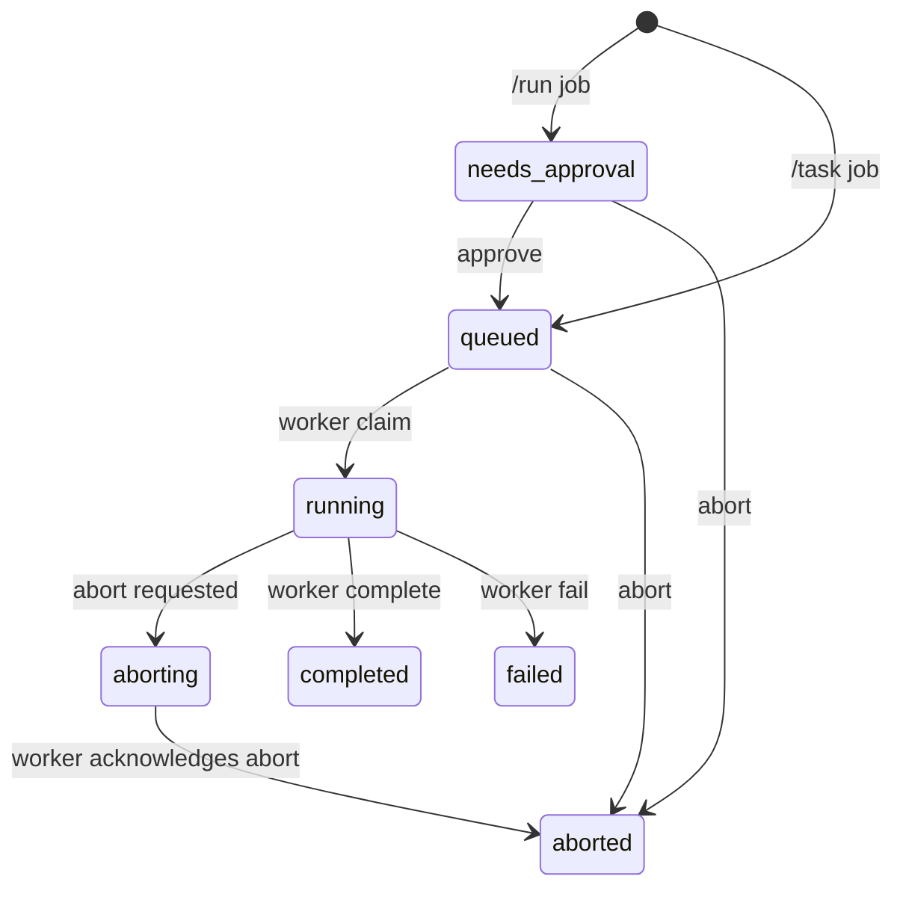

# Architecture

This document captures the current architecture of the personal Pi + Telegram agent stack.
Update it as you add features.

## System diagram

```mermaid
flowchart TD
    TG[Telegram Users] -->|messages| GW[telegram-gateway]
    GW -->|create/status/approve/abort| ORCH[orchestrator API]
    GW -->|admin pause/resume| ORCH

    ORCH -->|claim next job| WORKER[vm-worker]
    WORKER -->|worker events + complete/fail| ORCH
    ORCH -->|job/events polling| GW

    WORKER -->|RPC commands/events| PI[pi --mode rpc]
    WORKER -->|PATH includes generated wrappers| MCPBIN[.data/mcp/bin]
    WORKER --> PMEM[(SOUL.md + MEMORY.md + memory/YYYY-MM-DD.md)]

    GW --> PAIR[(pairings.json)]
    GW --> SCTX[(sessions.json)]
    ORCH --> STATE[(orchestrator state.json)]
    WORKER --> SESS[(Pi session files)]
    CLI -->|mcp sync| MCPCFG[config/mcp-clis.json]
    CLI -->|mcporter config| MCPDEF[config/mcporter.json]
    CLI -->|generate-cli/emit-ts| MCPBIN

    CLI[butler CLI] -->|setup (writes .env)| ENV[.env]
    CLI -->|doctor/up| GW
    CLI -->|doctor/up| ORCH
    CLI -->|doctor/up| WORKER
```

## Runtime model

- `telegram-gateway` is the control surface for users.
- `orchestrator` owns queue and job lifecycle.
- `vm-worker` runs in sandbox VM and executes jobs.
- `pi` runtime is accessed by worker in RPC mode (or mock mode for local testing).
- In RPC mode, worker defaults PI workspace to repo root so `SOUL.md`, `MEMORY.md`, and `memory/YYYY-MM-DD.md` are shared personality/memory context files.
- Gateway tracks per-chat/per-thread context keys in `sessions.json`; `/new` and `/reset` rotate to fresh context.
- `butler` CLI is the operator entrypoint for setup (`setup`), validation (`doctor`), and local process orchestration (`up`).
- `butler mcp` manages MCP-to-CLI generation via `mcporter` (`init`, `list`, `sync`).
- Gateway can run in agent-only reply mode (`TG_ONLY_AGENT_OUTPUT=true`) so Telegram receives only final agent text.

## Job lifecycle



## Security and policy implemented

- Pairing gate for unknown Telegram users.
- Owner allowlist required (`TG_OWNER_IDS`).
- Strong API secrets required for gateway/worker orchestration (`16+` chars).
- `/run` is owner-only by default and always requires approval.
- Non-owner users can only view their own jobs in their own chat.
- Optional requester abort is configurable.
- Rate limiting and max prompt length in gateway.
- Global panic switch (`/panic on|off`) pauses worker claims.
- Context reset controls (`/new`, `/reset`) are chat/thread-scoped.

## Current interfaces

### Gateway -> Orchestrator

- `POST /v1/jobs`
- `GET /v1/jobs/:jobId`
- `GET /v1/jobs/:jobId/events`
- `POST /v1/jobs/:jobId/approve`
- `POST /v1/jobs/:jobId/abort`
- `GET /v1/admin/state`
- `POST /v1/admin/pause`
- `POST /v1/admin/resume`

### Worker -> Orchestrator

- `POST /v1/workers/claim`
- `POST /v1/workers/:jobId/events`
- `GET /v1/workers/:jobId/heartbeat`
- `POST /v1/workers/:jobId/complete`
- `POST /v1/workers/:jobId/fail`
- `POST /v1/workers/:jobId/aborted`

## Next extension points

- Replace JSON state with PostgreSQL + migrations.
- Add Telegram webhook mode + secret token validation.
- Add inline keyboard actions for approve/abort/status.
- Add per-job artifact upload/download path.
- Add explicit policy engine (tool allow/deny, command classes).
